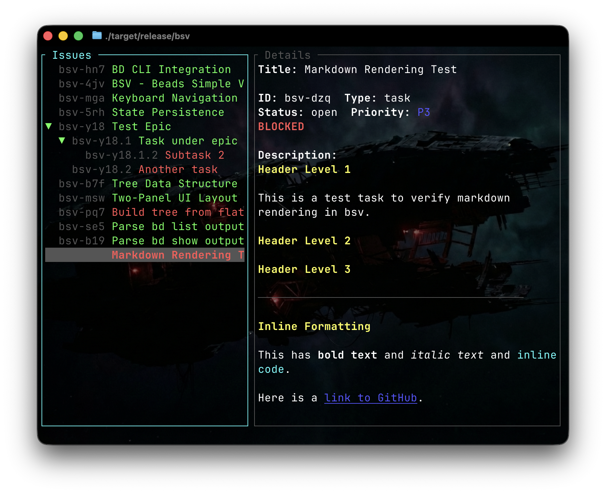

# bsv - Beads Simple Viewer

A terminal user interface (TUI) for viewing and navigating [Beads](https://github.com/steveyegge/beads) issues.



## Features

- **Two-panel layout**: Tree view on the left, issue details on the right
- **Hierarchical display**: Issues with dotted IDs (e.g., `proj-abc.1.2`) are shown as nested children
- **Visual status indicators**:
  - Green = Ready (no blockers)
  - Red = Blocked (has unresolved dependencies)
  - Gray = Closed
- **Markdown rendering**: Headers, code blocks, lists, tables, blockquotes, and inline formatting
- **Auto-refresh**: Watches `.beads/` directory for changes
- **State persistence**: Remembers expanded/collapsed state between sessions
- **Mouse support**: Click to select issues, scroll wheel in details panel

## Installation

Requires [Rust](https://rustup.rs/) and the [bd CLI](https://github.com/steveyegge/beads) to be installed.

```bash
git clone https://github.com/bglenden/bsv.git
cd bsv
cargo build --release
```

The binary will be at `target/release/bsv`. Copy it to a directory in your PATH.

## Usage

Run `bsv` from any directory containing a `.beads/` folder (or a parent directory with one).

```bash
bsv [OPTIONS]

OPTIONS:
    --help     Print help message
    --debug    Dump tree structure and exit
```

## Keybindings

### Tree Panel
| Key | Action |
|-----|--------|
| `j` / `↓` | Move cursor down |
| `k` / `↑` | Move cursor up |
| `g` / `Home` | Go to top |
| `G` / `End` | Go to bottom |
| `l` / `→` / `Enter` | Expand node / focus details |
| `h` / `←` | Collapse node / go to parent |
| `Space` | Toggle expand/collapse |
| `Tab` | Toggle expand/collapse all |

### Details Panel
| Key | Action |
|-----|--------|
| `j` / `k` | Scroll up/down |
| `g` / `G` | Go to top/bottom |
| `h` / `←` | Return to tree |
| Click | Focus panel |

### Global
| Key | Action |
|-----|--------|
| `c` | Toggle show/hide closed issues |
| `r` | Refresh data |
| `?` | Toggle help overlay |
| `q` / `Ctrl+C` | Quit |

## Configuration

Expanded state is saved to `~/.config/bsv/state.json`, keyed by the path to each beads database.

## Requirements

- [Beads](https://github.com/steveyegge/beads) (`bd` CLI) v0.34.0 or later
- A terminal with Unicode support

## License

MIT License - see [LICENSE](LICENSE) for details.
